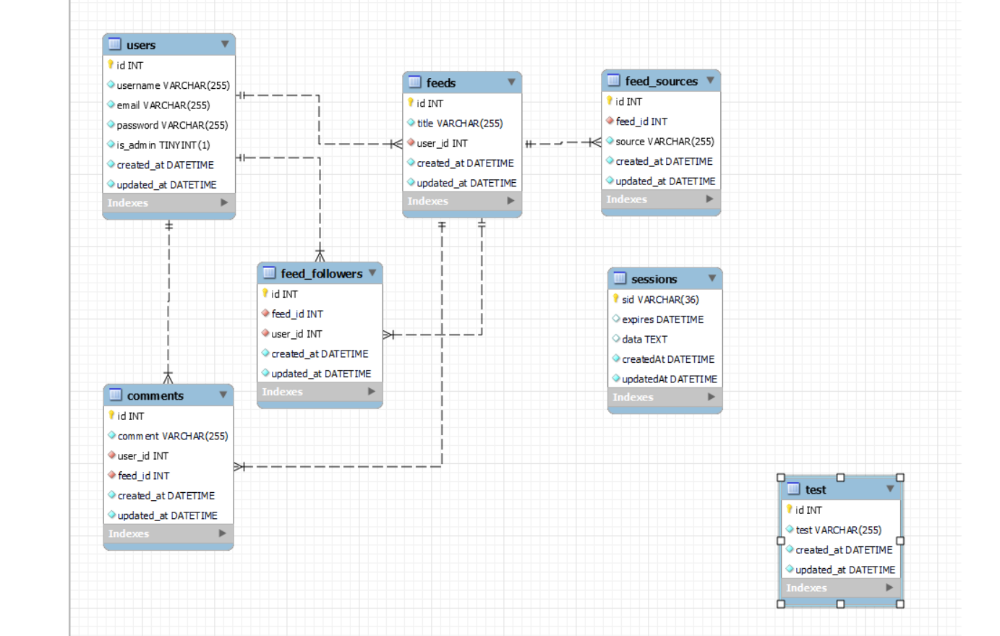
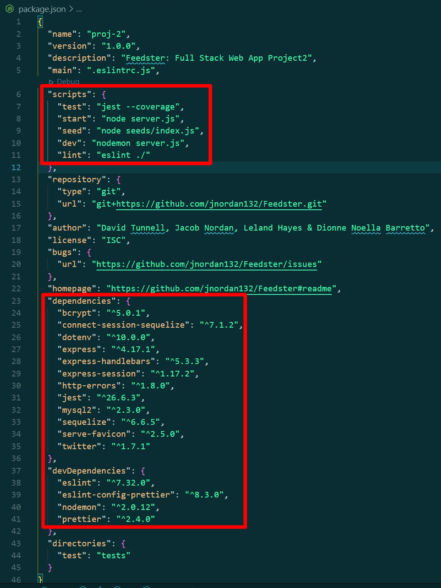
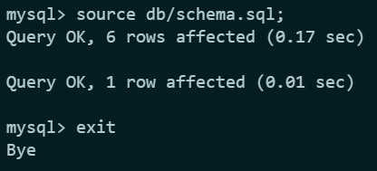
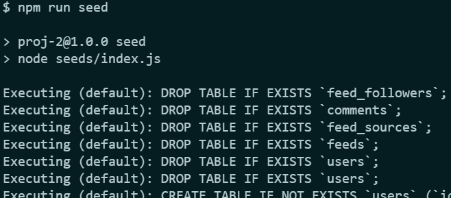
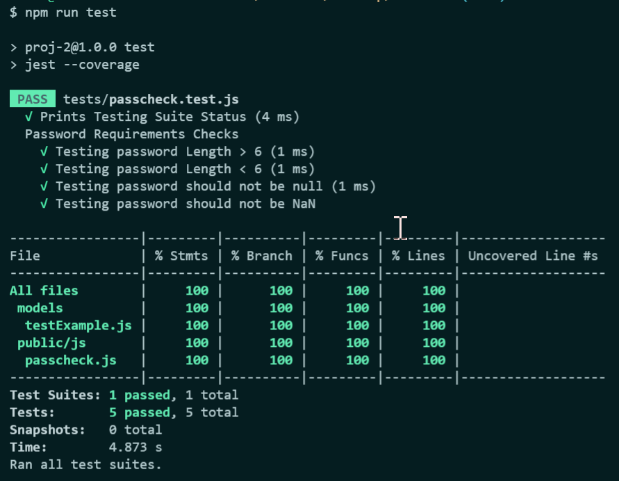
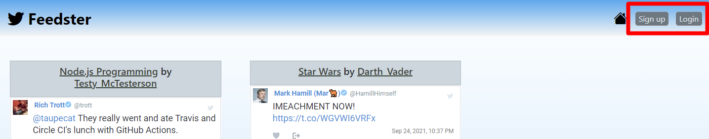

# Feedster - Twitter API, Node, Express, MySQL, Sequelize, Handlebars, MVC, Fullstack

Feedster is an MVC Fullstack Twitter content containerizer. You can create an account and create custom feeds of your favorite twitter users. These feeds can be shared (links) followed and experienced as a group using the comment section. This creates a new way to experience any interest, from a live sporting event to your favorite personalities for any subject.

[Live Demo Here](https://www.fake.com/).

Seeded User account credentials are:

-   username: test@gmail.com
-   password: 123456

Features:

This project uses the following technologies/libraries.

-   [Twitter for Node.js](https://www.npmjs.com/package/twitter) for server side [Twitter API](https://developer.twitter.com/en/docs/twitter-api) interactions
-   [Node.js](https://nodejs.org/en/) and [Express.js](https://expressjs.com/) as the Server for API and HTTP requests
-   [MySQL](https://www.mysql.com/) Database Schema
-   [Sequelize.js](https://sequelize.org/) for [Object Relational Mapping](https://en.wikipedia.org/wiki/Object%E2%80%93relational_mapping), Database Interaction, [Routing](https://expressjs.com/en/guide/routing.html) and Schema Generation and Seeding
-   [Dotenv](https://www.npmjs.com/package/dotenv) for Database Connection Settings
-   [Handlebars.js](https://handlebarsjs.com/) for Dynamic View Templating and Server Side HTML Rendering
-   [Bcrypt Package](https://www.npmjs.com/package/bcrypt) for Password Hashing and Management
-   [Express-Session](https://www.npmjs.com/package/express-session) and [connect-session-sequelize](https://www.npmjs.com/package/connect-session-sequelize) for Session and Cookie Management
-   [Bulma](https://bulma.io/) as a CSS Style Framework
-   [Nodemon](https://www.npmjs.com/package/nodemon) for Easier Server-Side Development
-   [Heroku](https://www.heroku.com) for Demo Deployment
-   [Serve-Favicon](https://www.npmjs.com/package/serve-favicon) for Favicon Use
-   [MVC Architecture](https://en.wikipedia.org/wiki/Model%E2%80%93view%E2%80%93controller) - Designed with Extensibility in Mind (Notice the Controller Routes, Client-Side JavaScript and Handlebar Views)

## Project Structure

## Installation

## Example API Call

## Database schema

## Screenshots

==============================

## Project Resources:

<!-- 👉[Watch - Project App Demo]()  -->

👉[Project Live URL (Heroku)](https://feedster-twitter-feed.herokuapp.com/) 
👉[Project Wireframe/Plan/Proposal](https://docs.google.com/presentation/d/12Ssp54Pa-8JnnrAwpo0s94ohWYoS_NhuVFpAaEvPIOY/edit?usp=sharing) 
👉[Project Presentation Deck](https://docs.google.com/presentation/d/1mRIDBl0DP-tDFZV7GiqyeLykqNoXN9z3CVnP8862yow/edit?usp=sharing) 
👉[Database Schema](./public/assets/database-schema.png)
   

## Technology Used in this Project

**Accessibility Testing:**   
**IDE/OS:**     
**Cloud Hosting:**    
**Frontend:**     
**Backend:**   
**Database:**   
**Frameworks:**         
**Linters:**   
**Social Media:**   
**Communication:**   

## App Usage/ Installation Instructions:

To use **Feedster** web interface:

a. Clone this repository to your local system  
b. Run `npm install` or `npm i` in order to install the npm package dependencies as specified in the `package.json` file     
c. Update the `.env.EXAMPLE` file by editing your mysql username and password for the db; including twitter specifics as defined in *https://www.npmjs.com/package/twitter*  
d. Update the file name from `.env.EXAMPLE` to `.env` and ensure this file is in the root folder itself  
e. Connect to the mysql DB locally and source the `schema.sql;` file by running `source db/schema.sql;` command  
_Example:_    
f. `exit` from the mysql connection to and `seed` the db by running `npm run seed`  
_Example:_    
g. Optionally, you can run `node run test` for _Jest_ - a javascript testing framework to kick off a series of quick tests (Dummy Tests)  
_Example:_    
h.Finally, to run this application enter `node server.js` or `npm start` to be prompted with the `localhost/port#` url  
i.On the **Feedster** [landing page](https://feedster-twitter-feed.herokuapp.com/) you will be presented with User Feeds you can opt to follow after Signing/Logging in
  
