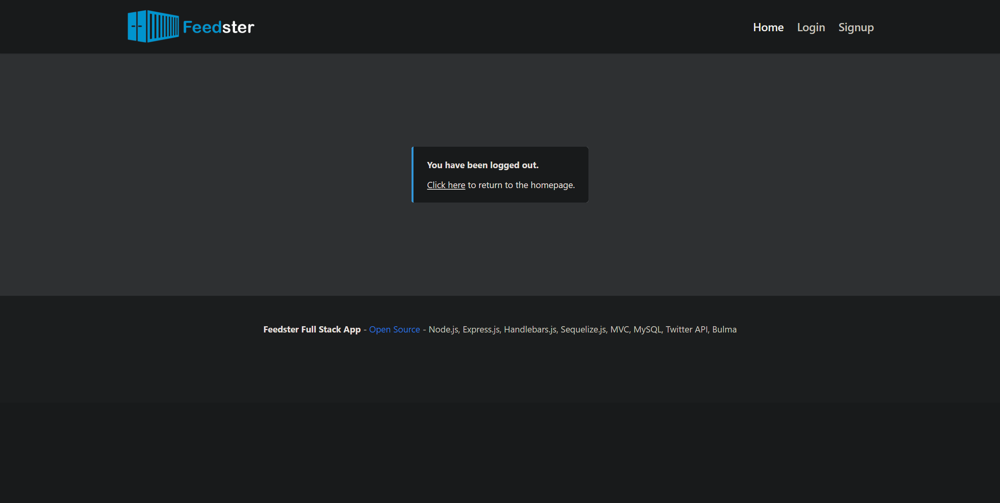

# Feedster - Twitter API, Node, Express, MySQL, Sequelize, Handlebars, MVC, Fullstack

Feedster is an MVC Fullstack Twitter content containerizer. You can create an account and create custom feeds of your favorite twitter users. These feeds can be shared (links) followed and experienced as a group using the comment section. This creates a new way to experience any interest, from a live sporting event to your favorite personalities for any subject. It is also mobile friendly.

[Live Demo Here](https://www.fake.com/).

Example seeded user account credentials are:

-   username: test@gmail.com
-   password: 123456

This project was a [group project](https://github.com/jnordan132/Feedster) that I have made additional updates to.

Features:

This project uses the following technologies/libraries.

-   [Twitter for Node.js](https://www.npmjs.com/package/twitter) for server side [Twitter API](https://developer.twitter.com/en/docs/twitter-api) interactions
-   [Node.js](https://nodejs.org/en/) and [Express.js](https://expressjs.com/) as the Server for API and HTTP requests
-   [MySQL](https://www.mysql.com/) Database Schema
-   [Sequelize.js](https://sequelize.org/) for [Object Relational Mapping](https://en.wikipedia.org/wiki/Object%E2%80%93relational_mapping), Database Interaction, [Routing](https://expressjs.com/en/guide/routing.html) and Schema Generation and Seeding
-   [Dotenv](https://www.npmjs.com/package/dotenv) for Database Connection Settings
-   [Handlebars.js](https://handlebarsjs.com/) for Dynamic View Templating and Server Side HTML Rendering
-   [Bcrypt Package](https://www.npmjs.com/package/bcrypt) for Password Hashing and Management
-   [Express-Session](https://www.npmjs.com/package/express-session) and [connect-session-sequelize](https://www.npmjs.com/package/connect-session-sequelize) for Session and Cookie Management
-   [Bulma](https://bulma.io/) as a CSS Style Framework
-   [Nodemon](https://www.npmjs.com/package/nodemon) for Easier Server-Side Development
-   [Heroku](https://www.heroku.com) for Demo Deployment
-   [Serve-Favicon](https://www.npmjs.com/package/serve-favicon) for Favicon Use
-   [MVC Architecture](https://en.wikipedia.org/wiki/Model%E2%80%93view%E2%80%93controller) - Designed with Extensibility in Mind (Notice the Controller Routes, Client-Side JavaScript and Handlebar Views)

## Project Structure

In the config folder is the Sequelize connection used throughout the server side and uses dotenv for connection properties. Additionally, config contains the Twitter object with credentials attached to be used throughout the application. The controllers folder holds the routing logic for the API and web app calls. The db folder just contains a script to generate the empty database that is used in this project. The models folder contains each of the models used in the MVC model and is connected to the database via Sequelize. The public folder contains css, images and JavaScript used by the client side application served to the end user's browser. This includes API calls to the RESTful API Node.js Server. It also contains screenshots for this README and the frontend's favicon. The seeds folder contains the JavaScript and JSON to create the database tables and seed them with test data. The utils folder has several server side helpers such as the authentication middleware and a DateTime formatter for rendering in the Handlebars.js views. It also has twitter API related calls used throughout the app. The views folder contains the Handlebars.js main layout template and child templates. The .env file contains the variables used as credentials for the MySQL database and the Twitter connection. Finally, ./server.js is the main file to run the server.

## Installation

After cloning the repo to your system, run `npm i` at the project root to get the node project dependencies and then update the file `.env.EXAMPLE` to `.env` and update it with your database credentials and [Twitter API credentials](https://developer.twitter.com/en/docs/twitter-api/getting-started/getting-access-to-the-twitter-api). You can also add a custom session secret key if you would like. If you want to change the database name `feedster_db` it also needs to be changed in the `./db/schema.sql` for database generation.

Then run the script to generate the `feedster_db` database using the `./db/schema.sql` on your MySQL database instance. Then use command `npm run seed` (notice the various commands available in `package.json`) to generate the tables and example data. Once this is complete use command `npm run dev` if you would like the server to use Nodemon and auto-restart when there are updates to code or `npm run start` for a normal server start.

The application will be available by default at http://localhost:3001/ if you are using a local development environment. The RESTful API will also be available to be called independently from the web app at http://localhost:3001/api/users/, http://localhost:3001/api/feeds/, http://localhost:3001/api/feedfollowers/ and http://localhost:3001/api/comments/.

## Example API Call

POST - http://localhost:3001/api/feeds/

```
{
   "title":"Node.js Programming",
   "user_id":"1",
   "sources":[
      {
         "source":"@nodejs"
      },
      {
         "source":"@trott"
      },
      {
         "source":"@adamzdanielle"
      }
   ]
}
```

## Database schema


# Screenshots

## Homepage


## Profile


## Create Feed Modal


## Individual Feed


## Login


## Signup


## Logout



## Mobile Friendly

[Screenshot Here](./public/assets/readme-screenshots/mobile-friendly.png).
